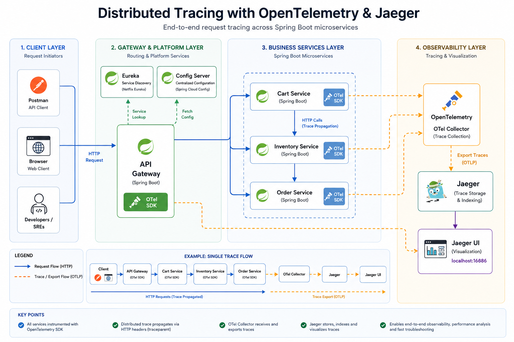

# Spring Boot Microservices with OpenTelemetry, Jaeger & Global Exception Handling

A production-ready distributed microservices architecture with **Spring Cloud**, **OpenTelemetry**, **Jaeger**, **FeignClient**, **Resilience4j Circuit Breakers**, and **Global Exception Handling**.

## 🏗️ Architecture Diagram



### **System Overview:**

```
┌─────────────────────────────────────────────────────────────────┐
│                         CLIENTS                                  │
│                    (Postman, Browser, etc.)                      │
└─────────────────┬───────────────────────────────────────────────┘
                  │
                  ▼
┌──────────────────────────────────────────────────────────────────┐
│                   API GATEWAY (Port 8099)                         │
│  • Routes all requests                                            │
│  • Load balancing with Eureka                                    │
│  • Distributed tracing injection                                 │
└───┬──────────────────────────────────────────────────────────────┘
    │
    ├─────────────────┬─────────────────┬──────────────────┐
    │                 │                 │                  │
    ▼                 ▼                 ▼                  ▼
┌──────────┐    ┌──────────┐    ┌──────────┐    ┌──────────┐
│   Cart   │───▶│  Order   │───▶│Inventory │    │ Status   │
│ Service  │    │ Service  │    │ Service  │    │Endpoints │
│  :8300   │    │  :8100   │    │  :8900   │    │          │
│          │    │          │    │          │    │          │
│ FeignClient  │ FeignClient  │          │    │          │
│ + Circuit    │ + Circuit    │          │    │          │
│   Breaker    │   Breaker    │          │    │          │
│ + Exception  │ + Exception  │ + Exception  │          │
│   Handler    │   Handler    │   Handler    │          │
└──────────┘    └──────────┘    └──────────┘    └──────────┘
    │                 │                 │
    └─────────────────┴─────────────────┴──────────────────┐
                                                             │
                                                             ▼
                                                    ┌─────────────────┐
                                                    │ Service Registry│
                                                    │   (Eureka)      │
                                                    │     :8761       │
                                                    └─────────────────┘
                                                             │
                                                             ▼
                                                    ┌─────────────────┐
                                                    │  Config Server  │
                                                    │     :7100       │
                                                    └─────────────────┘
                                                             │
                                                             ▼
                                                    ┌─────────────────┐
                                                    │  Jaeger UI      │
                                                    │  (Tracing)      │
                                                    │    :16686       │
                                                    └─────────────────┘
```

---

## 📋 Table of Contents

- [Features](#features)
- [Architecture](#architecture)
- [Service Overview](#service-overview)
- [Prerequisites](#prerequisites)
- [Quick Start](#quick-start)
  - [Option 1: Docker Compose (Recommended)](#option-1-docker-compose-recommended)
  - [Option 2: Manual JAR Execution](#option-2-manual-jar-execution)
- [Testing with Postman](#testing-with-postman)
- [Monitoring with Jaeger UI](#monitoring-with-jaeger-ui)
- [Global Exception Handling](#global-exception-handling)
- [Circuit Breaker & Resilience](#circuit-breaker--resilience)
- [API Reference](#api-reference)
- [Project Structure](#project-structure)
- [Troubleshooting](#troubleshooting)
- [Documentation](#documentation)
- [License](#license)

---

## ✨ Features

- ✅ **Microservices Architecture** - 6 services with clear separation of concerns
- ✅ **Service Discovery** - Eureka Server for dynamic service registration
- ✅ **Centralized Configuration** - Spring Cloud Config Server
- ✅ **API Gateway** - Single entry point with intelligent routing
- ✅ **FeignClient** - Declarative REST clients for service communication
- ✅ **Circuit Breakers** - Resilience4j for fault tolerance
- ✅ **Global Exception Handling** - Consistent error responses across services
- ✅ **Distributed Tracing** - OpenTelemetry + Jaeger for request tracking
- ✅ **Docker Support** - Complete Docker Compose setup
- ✅ **Health Checks** - Spring Actuator for monitoring
- ✅ **Comprehensive Testing** - Unit tests and Postman collections

---

## 🏗️ Architecture

```
Client
  └─▶ api-gateway :8099
        ├─▶ cart-service :8300
        │     └─▶ order-service :8100
        │           └─▶ inventory-service :8900
        ├─▶ order-service :8100
        └─▶ inventory-service :8900

service-registry :8761  ←  all services register here
configserver     :7100  ←  all services fetch config from here
jaeger           :16686 ←  receives and visualizes traces
```

---

## Service Overview

| Service | Port | Role |
|---|---|---|
| `service-registry` | 8761 | Eureka Server — service discovery |
| `configserver` | 7100 | Central config server |
| `api-gateway` | 8099 | Single entry point, routes all traffic |
| `order-service` | 8100 | Creates orders, calls inventory-service |
| `inventory-service` | 8900 | Reserves inventory items |
| `cart-service` | 8300 | Checkout flow, calls order-service |
| `jaeger` | 16686 | Trace UI |

**Startup order** (Docker Compose enforces this via `depends_on` + `healthcheck`):

```
1. service-registry   ← everything registers here
2. configserver       ← services fetch config on startup
3. api-gateway, order-service, inventory-service, cart-service
```

---

## API Gateway

The `api-gateway` is the **only service exposed externally**. It resolves service names via Eureka (`lb://`) and strips the service-name prefix before forwarding.

### Route Table

| Client Request | Forwarded To | Actual Endpoint |
|---|---|---|
| `POST /cart-service/cart/checkout` | `lb://cart-service` | `cart-service:8300/cart/checkout` |
| `POST /order-service/orders/create` | `lb://order-service` | `order-service:8100/orders/create` |
| `POST /inventory-service/inventory/reserve` | `lb://inventory-service` | `inventory-service:8900/inventory/reserve` |

`StripPrefix=1` removes the first path segment before forwarding. `lb://` triggers Eureka-based load balancing.

### Key Configuration (`api-gateway.properties`)

```properties
server.port=8099

spring.cloud.gateway.server.webflux.routes[0].uri=lb://order-service
spring.cloud.gateway.server.webflux.routes[0].predicates[0]=Path=/order-service/**
spring.cloud.gateway.server.webflux.routes[0].filters[0]=StripPrefix=1

management.tracing.sampling.probability=1.0
management.otlp.tracing.endpoint=http://${JAEGER_HOST:localhost}:4318/v1/traces

eureka.client.serviceUrl.defaultZone=http://${EUREKA_HOST:localhost}:8761/eureka/
```

### Key Dependencies

| Dependency | Purpose |
|---|---|
| `spring-cloud-starter-gateway-server-webflux` | Core reactive routing engine |
| `spring-cloud-starter-netflix-eureka-client` | Enables `lb://` service name resolution |
| `spring-cloud-starter-openfeign` | Declarative REST clients for service-to-service calls |
| `spring-cloud-starter-config` | Fetches config from configserver |
| `spring-boot-starter-actuator` | Exposes `/actuator/health` for Docker healthcheck |
| `spring-cloud-starter-circuitbreaker-resilience4j` | Circuit breaker for fault tolerance |
| `micrometer-tracing` | Tracing API |
| `micrometer-tracing-bridge-otel` | Bridges Micrometer → OpenTelemetry |
| `opentelemetry-exporter-otlp` | Exports spans to Jaeger via OTLP |

---

## Request Flow

### Cart Checkout (full chain)

```
Client  POST /cart-service/cart/checkout
  └─▶ api-gateway        strips prefix, resolves lb://cart-service
        └─▶ cart-service        calls http://order-service/orders/create
              └─▶ order-service       calls http://inventory-service/inventory/reserve
                    └─▶ inventory-service   reserves items, returns response
                    ◀─  order-service       creates orderId, returns to cart
              ◀─  cart-service        returns checkout result
        ◀─  api-gateway        returns final response to client
```

### Service-to-Service Calls

Services use **Spring Cloud OpenFeign** for declarative, type-safe REST client communication. Eureka automatically resolves service names to actual IPs at runtime.

#### **FeignClient Interface (Declarative)**

```java
@FeignClient(
    name = "order-service",
    fallback = OrderServiceClientFallback.class  // Circuit breaker fallback
)
public interface OrderServiceClient {
    
    @PostMapping("/orders/create")
    OrderResponse createOrder(@RequestBody OrderRequest request);
}
```

#### **Using FeignClient in Service**

```java
@RestController
public class CartController {
    private final OrderServiceClient orderServiceClient;
    
    public CartController(OrderServiceClient orderServiceClient) {
        this.orderServiceClient = orderServiceClient;
    }
    
    @PostMapping("/cart/checkout")
    public ResponseEntity<?> checkout(@RequestBody CartRequest request) {
        // Clean, type-safe service call
        OrderResponse response = orderServiceClient.createOrder(
            new OrderRequest(request.getItems())
        );
        return ResponseEntity.ok(response);
    }
}
```

#### **Benefits over RestTemplate**
- ✅ **Declarative** - Interface-based, no manual URL construction
- ✅ **Type-Safe** - Compile-time validation with POJOs
- ✅ **Circuit Breaker** - Built-in Resilience4j integration
- ✅ **Less Code** - 30% reduction in boilerplate
- ✅ **Better Testing** - Easy to mock interfaces

---

## Circuit Breaker & Resilience

### **Resilience4j Integration**

The system uses **Resilience4j** circuit breakers to prevent cascading failures and provide graceful degradation.

### **Circuit Breaker States**

```
CLOSED (Normal) → 50% failure rate → OPEN (Blocking)
     ↑                                      ↓
     ←──── Service healthy ←──── HALF-OPEN (Testing)
```

### **Configuration**

Circuit breaker settings in `application-resilience.yml`:

```yaml
resilience4j:
  circuitbreaker:
    instances:
      orderService:
        failureRateThreshold: 50          # Open after 50% failures
        minimumNumberOfCalls: 5           # Need 5 calls to calculate
        waitDurationInOpenState: 15s      # Stay open for 15s
        slidingWindowSize: 10             # Track last 10 calls
```

### **Fallback Responses**

When a circuit opens, fallback implementations provide friendly error responses:

```java
@Component
public class OrderServiceClientFallback implements OrderServiceClient {
    @Override
    public OrderResponse createOrder(OrderRequest request) {
        OrderResponse fallback = new OrderResponse();
        fallback.setStatus(503);
        fallback.setMessage("Order service temporarily unavailable");
        fallback.getData().put("fallback", true);
        return fallback;
    }
}
```

### **Testing Circuit Breaker**

```bash
# 1. Stop a service to simulate failure
docker stop inventory-service

# 2. Make 5+ requests to trigger circuit
for i in {1..6}; do
  curl -X POST http://localhost:8099/order-service/orders/create \
    -H "Content-Type: application/json" \
    -d '{"items": [{"id": "product-1", "qty": 1}]}'
done

# 3. Circuit opens, fallback provides friendly error
# 4. Restart service: docker start inventory-service
# 5. Circuit automatically recovers after testing service health
```

---

## Distributed Tracing

Every service exports traces to Jaeger via OTLP:

```properties
management.tracing.sampling.probability=1.0
management.otlp.tracing.endpoint=http://${JAEGER_HOST:localhost}:4318/v1/traces
```

The `api-gateway` creates a `traceId` on each incoming request and injects it as a `traceparent` header. Downstream services propagate it, producing a single unified trace in Jaeger:

```
traceId: abc123
  ├── api-gateway          0ms → 45ms
  ├── cart-service         2ms → 40ms
  ├── order-service        5ms → 35ms
  └── inventory-service   10ms → 30ms
```

---

## 🚀 Prerequisites

Before running this project, ensure you have:

- **Java 21** - Required for Spring Boot 3.5.5
- **Maven or Gradle** - Build tools (Gradle wrapper included)
- **Docker & Docker Compose** - For containerized deployment
- **Postman** (Optional) - For API testing
- **Git** - To clone the repository

### **Verify Java Installation:**

```bash
java -version
# Should show: openjdk version "21.x.x"
```

If you don't have Java 21, see [BUILD_GUIDE.md](BUILD_GUIDE.md) for installation instructions.

---

## 🚀 Quick Start

### **Option 1: Docker Compose (Recommended)**

This is the easiest way to run all services with proper startup ordering and health checks.

#### **Step 1: Clone the Repository**

```bash
git clone https://github.com/satya-moganti/springboot-opentemetry-jaeger.git
cd springboot-opentemetry-jaeger
```

#### **Step 2: Check Port Availability (Optional)**

Before starting services, verify that all required ports are available:

```bash
# Windows - PowerShell (Recommended - detailed output)
.\check-ports.ps1

# Windows - Command Prompt (Basic check)
.\check-ports.bat
```

The script checks these ports:
- **8761** - Service Registry (Eureka)
- **7100** - Config Server
- **8099** - API Gateway
- **8300** - Cart Service
- **8100** - Order Service
- **8900** - Inventory Service
- **16686** - Jaeger UI
- **4318** - Jaeger OTLP

**Sample Output:**
```
[OK] Port 8761 - AVAILABLE - Service Registry (Eureka)
[X] Port 8099 - IN USE     - API Gateway
    Process: java (PID: 12345)
```

If ports are in use, the script will provide commands to stop the conflicting processes.

#### **Step 3: Build All Services**

```bash
# Build all JARs (Windows)
build-all.bat

# Build all JARs (Linux/Mac)
./build-all.sh

# Or build individually
cd cart-service
./gradlew clean build -x test
cd ../order-service
./gradlew clean build -x test
# ... repeat for other services
```

#### **Step 4: Start with Docker Compose**

```bash
# Start all services in background
docker-compose up -d

# Or start with logs visible
docker-compose up

# View logs of specific service
docker-compose logs -f cart-service

# Check status
docker-compose ps
```

#### **Step 5: Verify Services are Running**

Wait 1-2 minutes for all services to start, then check:

```bash
# Eureka Dashboard - See all registered services
http://localhost:8761

# Jaeger UI - Distributed tracing
http://localhost:16686

# Health Checks
curl http://localhost:8099/actuator/health  # API Gateway
curl http://localhost:8300/actuator/health  # Cart Service
curl http://localhost:8100/actuator/health  # Order Service
curl http://localhost:8900/actuator/health  # Inventory Service
```

#### **Step 6: Stop Services**

```bash
# Stop all services
docker-compose down

# Stop and remove volumes
docker-compose down -v
```

---

### **Option 2: Manual JAR Execution**

Run each service manually in the correct startup order. **Each command must be run in a separate terminal window.**

#### **Prerequisites:**
- Check port availability first (run `.\check-ports.ps1`)
- All services must be built first (see Step 3 above)
- Java 21 must be in your PATH

#### **Startup Sequence:**

**Terminal 1 - Service Registry (Eureka)**
```bash
cd service-registry
java -jar build/libs/service-registry-0.0.1-SNAPSHOT.jar

# Wait for: "Started ServiceRegistryApplication"
# Verify: http://localhost:8761
```

**Terminal 2 - Config Server**
```bash
cd configserver
java -jar build/libs/configserver-0.0.1-SNAPSHOT.jar

# Wait for: "Started ConfigserverApplication"
# Verify: http://localhost:7100/actuator/health
```

**Terminal 3 - Inventory Service**
```bash
cd inventory-service
java -jar build/libs/inventory-service-0.0.1-SNAPSHOT.jar

# Wait for: "Started InventoryServiceApplication"
# Check Eureka: Should see "INVENTORY-SERVICE" registered at http://localhost:8761
```

**Terminal 4 - Order Service**
```bash
cd order-service
java -jar build/libs/order-service-0.0.1-SNAPSHOT.jar

# Wait for: "Started OrderServiceApplication"
# Check Eureka: Should see "ORDER-SERVICE" registered
```

**Terminal 5 - Cart Service**
```bash
cd cart-service
java -jar build/libs/cart-service-0.0.1-SNAPSHOT.jar

# Wait for: "Started CartServiceApplication"
# Check Eureka: Should see "CART-SERVICE" registered
```

**Terminal 6 - API Gateway**
```bash
cd api-gateway
java -jar build/libs/api-gateway-0.0.1-SNAPSHOT.jar

# Wait for: "Started ApiGatewayApplication"
# Verify: http://localhost:8099/actuator/health
```

**Terminal 7 - Jaeger (Optional - For Tracing)**
```bash
docker run -d \
  --name jaeger \
  -p 16686:16686 \
  -p 4318:4318 \
  jaegertracing/all-in-one:latest

# Access Jaeger UI: http://localhost:16686
```

#### **Verify All Services:**

Open Eureka Dashboard at http://localhost:8761 - you should see all 5 services registered:
- API-GATEWAY
- CART-SERVICE
- ORDER-SERVICE
- INVENTORY-SERVICE
- CONFIGSERVER

---

## 🧪 Testing with Postman

### **Step 1: Import Postman Collection**

Create a new Postman collection with the following requests:

#### **1. Health Check - API Gateway**
```
GET http://localhost:8099/actuator/health
```

#### **2. Checkout (Full Chain)**
```
POST http://localhost:8099/cart/checkout
Content-Type: application/json

{
  "items": [
    {"itemId": "ITEM-001", "quantity": 2},
    {"itemId": "ITEM-002", "quantity": 1}
  ]
}
```

**Expected Response (200 OK):**
```json
{
  "timestamp": "2026-09-04T22:45:30.123",
  "status": 200,
  "message": "Checkout initiated successfully",
  "data": {
    "service": "cart-service",
    "orderResponse": {
      "timestamp": "2026-09-04T22:45:30.456",
      "status": 200,
      "message": "Order created successfully",
      "data": {
        "orderId": "abc-123-def-456",
        "service": "order-service",
        "inventoryResponse": {
          "status": 200,
          "message": "Items reserved successfully"
        }
      }
    }
  }
}
```

#### **3. Create Order Directly**
```
POST http://localhost:8099/orders/create
Content-Type: application/json

{
  "items": [
    {"itemId": "ITEM-003", "quantity": 5}
  ]
}
```

#### **4. Reserve Inventory Directly**
```
POST http://localhost:8099/inventory/reserve
Content-Type: application/json

{
  "items": [
    {"itemId": "ITEM-004", "quantity": 3}
  ]
}
```

### **Step 2: Test Error Scenarios**

#### **2.1 Empty Cart Validation**
```
POST http://localhost:8099/cart/checkout
Content-Type: application/json

{
  "items": []
}
```

**Expected Response (400 Bad Request):**
```json
{
  "timestamp": "2026-09-04T22:46:00.123",
  "status": 400,
  "error": "EMPTY_CART",
  "message": "Cannot checkout with empty cart",
  "path": "/cart/checkout"
}
```

#### **2.2 Malformed JSON**
```
POST http://localhost:8099/cart/checkout
Content-Type: application/json

{
  "items": invalid json
}
```

**Expected Response (400 Bad Request):**
```json
{
  "timestamp": "2026-09-04T22:46:15.456",
  "status": 400,
  "error": "Malformed Request",
  "message": "Invalid JSON format in request body",
  "path": "/cart/checkout"
}
```

#### **2.3 Circuit Breaker Testing**

**Step 1:** Stop inventory service
```bash
docker-compose stop inventory-service
# OR if running manually: Ctrl+C in inventory-service terminal
```

**Step 2:** Make 6+ requests to trigger circuit breaker
```bash
# In Postman, send this request 6 times:
POST http://localhost:8099/orders/create
Content-Type: application/json

{
  "items": [{"itemId": "ITEM-001", "quantity": 1}]
}
```

**First 5 requests:** Will attempt to call inventory service and fail (503)

**6th request onward:** Circuit breaker opens, returns immediately:
```json
{
  "timestamp": "2026-09-04T22:47:00.789",
  "status": 503,
  "error": "Service Temporarily Unavailable",
  "message": "The requested service is temporarily unavailable. Circuit breaker is OPEN. Please try again later.",
  "path": "/orders/create"
}
```

**Step 3:** Restart inventory service
```bash
docker-compose start inventory-service
```

Circuit breaker will automatically recover after 15 seconds and try a test request.

#### **2.4 Insufficient Stock (10% Chance)**

Send this request multiple times - about 1 in 10 will trigger insufficient stock:

```
POST http://localhost:8099/inventory/reserve
Content-Type: application/json

{
  "items": [{"itemId": "RANDOM-ITEM", "quantity": 10}]
}
```

**When triggered (409 Conflict):**
```json
{
  "timestamp": "2026-09-04T22:48:00.123",
  "status": 409,
  "error": "INSUFFICIENT_STOCK",
  "message": "Insufficient stock for item 'ITEM-123'. Requested: 10, Available: 2",
  "path": "/inventory/reserve"
}
```

### **Step 3: Postman Collection Variables**

Set these variables in Postman for easier testing:

| Variable | Value |
|----------|-------|
| `base_url` | `http://localhost:8099` |
| `cart_service` | `{{base_url}}/cart` |
| `order_service` | `{{base_url}}/orders` |
| `inventory_service` | `{{base_url}}/inventory` |

---

## 📊 Monitoring with Jaeger UI

Jaeger provides powerful distributed tracing visualization to understand request flows and identify performance bottlenecks.

### **Accessing Jaeger UI**

Open your browser and navigate to: **http://localhost:16686**

### **Step-by-Step: Viewing Traces**

#### **Step 1: Generate Traces**

First, send some requests through Postman to generate traces:

```bash
# Send 3-5 requests
POST http://localhost:8099/cart/checkout
{
  "items": [{"itemId": "ITEM-001", "quantity": 2}]
}
```

#### **Step 2: Search for Traces**

In Jaeger UI:

1. **Service Dropdown** - Select `api-gateway`
2. **Operation Dropdown** - Select `POST` (or leave as "all")
3. **Lookback** - Set to "Last Hour"
4. Click **"Find Traces"** button

You'll see a list of recent traces - each row represents one complete request flow.

#### **Step 3: Analyze a Trace**

Click on any trace to see the detailed waterfall view:

```
TraceID: abc123def456... (Total Duration: 45ms)
├─ api-gateway         [0ms → 45ms]  HTTP POST /cart/checkout
│  └─ cart-service     [2ms → 43ms]  HTTP POST /orders/create
│     └─ order-service [5ms → 40ms]  HTTP POST /inventory/reserve
│        └─ inventory-service [8ms → 35ms] reserveItems
```

**What each span shows:**
- **Span Name** - Service and operation
- **Start Time** - When the span started relative to trace
- **Duration** - How long the operation took
- **Tags** - HTTP method, status code, URL, etc.
- **Logs** - Timestamps and events within the span

#### **Step 4: Identify Performance Issues**

Look for:
- **Long durations** - Services taking too long
- **Gaps between spans** - Network latency
- **Error tags** - `error=true` or `http.status_code=500`
- **Multiple retries** - Repeated attempts to same service

#### **Step 5: Filter Traces**

**By Status Code:**
```
Tags → http.status_code = 500
```

**By Service:**
```
Service → cart-service
Tags → http.method = POST
```

**By Error:**
```
Tags → error = true
```

**By Trace ID:**
If you have a specific trace ID from logs, use **"Lookup by Trace ID"** at the top.

#### **Step 6: Compare Traces**

Open multiple traces in different tabs to compare:
- **Success vs Failure** - What's different?
- **Fast vs Slow** - Where's the bottleneck?
- **Before vs After** - Did your optimization work?

### **Understanding Trace Context**

Each span includes valuable metadata:

**Process Information:**
- Service name
- Service version
- Hostname/IP

**Tags:**
- `http.method`: POST, GET, etc.
- `http.url`: Full request URL
- `http.status_code`: 200, 400, 500, etc.
- `span.kind`: server, client, internal
- `error`: true/false
- `component`: spring-webmvc, feign, etc.

**Logs:**
- Request start/end timestamps
- Exception details (if any)
- Custom log entries

### **Advanced Jaeger Features**

#### **Service Dependencies**

Click **"Dependencies"** in top menu to see:
- Which services call which services
- Request volume between services
- Average latency for each connection

#### **System Architecture**

Click **"System Architecture"** to visualize:
- All services in the system
- Service connections
- Request flow patterns

#### **Trace Comparison**

Select multiple traces and click **"Compare"** to see:
- Side-by-side waterfall views
- Duration differences
- Span variations

---

## ⚠️ Global Exception Handling

All business services implement comprehensive global exception handling for consistent error responses.

### **Standardized Error Response Format**

All errors return this consistent structure:

```json
{
  "timestamp": "2026-09-04T22:50:00.123",
  "status": 400,
  "error": "ERROR_CODE",
  "message": "Human-readable error message",
  "path": "/api/endpoint",
  "traceId": "optional-trace-id",
  "validationErrors": [
    {
      "field": "fieldName",
      "rejectedValue": "value",
      "message": "Validation message"
    }
  ]
}
```

### **Exception Types Handled**

| Exception | HTTP Status | Description |
|-----------|-------------|-------------|
| `BusinessException` | 400 | Business logic violations |
| `InsufficientStockException` | 409 | Stock unavailable (Inventory only) |
| `FeignException` | Varies | Downstream service errors |
| `CallNotPermittedException` | 503 | Circuit breaker OPEN |
| `MethodArgumentNotValidException` | 400 | Validation errors |
| `HttpMessageNotReadableException` | 400 | Malformed JSON |
| `NoHandlerFoundException` | 404 | Endpoint not found |
| `Exception` (catch-all) | 500 | Unexpected errors |

### **Testing Exception Handling**

See [EXCEPTION_HANDLING_GUIDE.md](EXCEPTION_HANDLING_GUIDE.md) for:
- Complete exception type documentation
- Testing scenarios
- Integration examples
- Best practices

---

## API Reference

All requests go through the API Gateway at `http://localhost:8099`.

**Cart Checkout** — full chain (gateway → cart → order → inventory)
```http
POST /cart-service/cart/checkout
Content-Type: application/json

{
  "items": [
    { "id": "product-1", "qty": 2 },
    { "id": "product-2", "qty": 1 }
  ]
}
```

**Create Order** — gateway → order → inventory
```http
POST /order-service/orders/create
Content-Type: application/json

{
  "items": [
    { "id": "product-1", "qty": 1 }
  ]
}
```

**Reserve Inventory** — gateway → inventory
```http
POST /inventory-service/inventory/reserve
Content-Type: application/json

{
  "items": [
    { "id": "product-1", "qty": 1 }
  ]
}
```

After making requests, open `http://localhost:16686` and select a service to view the full distributed trace.

---

## Testing the Jaeger UI

### Step 1 — Send a request to generate traces

```bash
curl -X POST http://localhost:8099/cart-service/cart/checkout \
  -H "Content-Type: application/json" \
  -d '{"items": [{"id": "product-1", "qty": 2}, {"id": "product-2", "qty": 1}]}'
```

### Step 2 — Open Jaeger UI

Navigate to `http://localhost:16686`

### Step 3 — Search for traces

1. In the **Service** dropdown, select a service (e.g., `api-gateway`, `cart-service`)
2. Click **Find Traces**
3. The results list shows recent traces — each row is one end-to-end request

### Step 4 — Inspect a trace

Click any trace row to open the waterfall view:

```
traceId: abc123  (total: ~45ms)
  ├── api-gateway          0ms → 45ms   [HTTP POST /cart-service/cart/checkout]
  ├── cart-service         2ms → 40ms   [HTTP POST /orders/create]
  ├── order-service        5ms → 35ms   [HTTP POST /inventory/reserve]
  └── inventory-service   10ms → 30ms   [inventory reservation]
```

- Each bar is a **span** — click it to see tags (HTTP method, status code, URL) and logs
- The `traceId` is shared across all spans, linking the full call chain
- Gaps between spans indicate network latency between services

### Step 5 — Compare traces across services

Use **Search** → **Tags** to filter by `http.status_code=500` or `error=true` to quickly find failed requests.

### Step 6 — Find a trace by ID

If you capture the `traceId` from a response header (`traceparent`) or logs, paste it directly into **Lookup by Trace ID** on the Jaeger home page for instant lookup.

---

## Testing

### **Unit Tests**

The project includes comprehensive unit tests for FeignClient-based service communication.

#### **Running Tests**

```bash
# Run all tests for cart-service
cd cart-service
./mvnw test

# Run all tests for order-service
cd order-service
./mvnw test

# Run specific test
./mvnw test -Dtest=CartControllerTest#checkout_Success

# Run with coverage report
./mvnw test jacoco:report
# View report: target/site/jacoco/index.html
```

#### **Test Coverage**

| Service | Test File | Tests |
|---------|-----------|-------|
| cart-service | `CartControllerTest.java` | ✅ Success scenario<br>✅ Service unavailable<br>✅ Fallback triggered |
| order-service | `OrderControllerTest.java` | ✅ Success scenario<br>✅ Service unavailable<br>✅ Fallback triggered |

#### **Sample Test**

```java
@WebMvcTest(CartController.class)
class CartControllerTest {
    
    @MockBean
    private OrderServiceClient orderServiceClient;
    
    @Test
    void checkout_Success() throws Exception {
        // Arrange: Mock FeignClient response
        OrderResponse mockResponse = new OrderResponse();
        mockResponse.setStatus(200);
        when(orderServiceClient.createOrder(any()))
            .thenReturn(mockResponse);
        
        // Act & Assert
        mockMvc.perform(post("/cart/checkout")
                .contentType(MediaType.APPLICATION_JSON)
                .content(cartRequestJson))
                .andExpect(status().isOk())
                .andExpect(jsonPath("$.status").value(200));
    }
}
```

### **Integration Testing with Postman**

Use the provided Postman collections in the `postman/` directory:

```bash
# Import collections into Postman
postman/01_infrastructure_health.json  # Health checks
Microservices/*.json                    # API tests
```

---

## Project Structure

```
/
├── api-gateway/
│   ├── src/main/java/com/jayam/api_gateway/
│   ├── src/main/resources/application.properties
│   ├── pom.xml / build.gradle
│   └── Dockerfile
├── cart-service/
│   ├── src/main/java/com/jayam/cart_service/
│   │   ├── client/
│   │   │   ├── OrderServiceClient.java          ← FeignClient interface
│   │   │   └── OrderServiceClientFallback.java  ← Circuit breaker fallback
│   │   ├── config/
│   │   │   ├── FeignConfig.java                 ← Feign configuration
│   │   │   └── RestTemplateConfig.java          (deprecated)
│   │   ├── controller/
│   │   │   └── CartController.java
│   │   └── dto/
│   │       ├── OrderRequest.java
│   │       └── OrderResponse.java
│   ├── src/main/resources/
│   │   ├── application.properties
│   │   └── application-resilience.yml           ← Circuit breaker config
│   ├── src/test/java/
│   │   └── com/jayam/cart_service/controller/
│   │       └── CartControllerTest.java          ← Unit tests
│   ├── pom.xml / build.gradle
│   └── Dockerfile
├── order-service/
│   ├── src/main/java/com/jayam/order_service/
│   │   ├── client/
│   │   │   ├── InventoryServiceClient.java      ← FeignClient interface
│   │   │   └── InventoryServiceClientFallback.java
│   │   ├── config/
│   │   │   ├── FeignConfig.java
│   │   │   └── RestTemplateConfig.java          (deprecated)
│   │   ├── Controller/
│   │   │   └── OrderController.java
│   │   └── dto/
│   │       ├── InventoryRequest.java
│   │       └── InventoryResponse.java
│   ├── src/main/resources/
│   │   ├── application.properties
│   │   └── application-resilience.yml
│   ├── src/test/java/
│   │   └── com/jayam/order_service/Controller/
│   │       └── OrderControllerTest.java
│   ├── pom.xml / build.gradle
│   └── Dockerfile
├── inventory-service/
│   ├── src/main/java/com/jayam/inventory_service/
│   ├── pom.xml / build.gradle
│   └── Dockerfile
├── configserver/
│   ├── src/main/resources/config/    ← per-service .properties files
│   ├── pom.xml / build.gradle
│   └── Dockerfile
├── service-registry/
│   ├── pom.xml / build.gradle
│   └── Dockerfile
├── postman/                           ← Postman test collections
│   └── 01_infrastructure_health.json
├── docker-compose.yaml
├── FEIGN_MIGRATION.md                 ← Migration guide
├── ENHANCEMENTS_GUIDE.md              ← Circuit breaker & testing guide
├── README.md
└── LICENSE
```

---

## Troubleshooting

### **Port Conflicts**

**Problem:** Service fails to start with "Address already in use" error

**Solution:**

1. **Check port availability:**
   ```bash
   # Windows PowerShell (detailed)
   .\check-ports.ps1
   
   # Windows CMD (basic)
   .\check-ports.bat
   ```

2. **Stop conflicting processes:**
   ```bash
   # Stop specific Java process by PID
   taskkill /PID [Process_ID] /F
   
   # Stop all Java processes
   taskkill /IM java.exe /F
   
   # PowerShell: Stop by process name
   Stop-Process -Name java -Force
   ```

3. **Stop Docker containers:**
   ```bash
   docker-compose down
   ```

4. **View detailed report:**
   - After running `check-ports.ps1`, check `port-check-report.txt` for full details

### **Common Issues**

| Problem | Likely Cause | Fix |
|---|---|---|
| **Port 8761 in use** | Old Eureka instance running | Run `check-ports.ps1` and stop the process using port 8761 |
| **Port 8099 in use** | Another web server running | Stop the process or change API Gateway port in `application.properties` |
| **Multiple ports in use** | Previous manual startup not stopped | Stop all Java processes: `taskkill /IM java.exe /F` |
| **No traces in Jaeger** | Wrong OTLP endpoint | Check `JAEGER_HOST` env var and `management.otlp.tracing.endpoint` |
| **Services not in Eureka** | Registry not up | Ensure `service-registry` is healthy before starting other services |
| **`lb://` routing fails** | Service not registered | Verify service is running and visible at `http://localhost:8761` |
| **Config not loading** | Configserver not ready | Ensure `configserver` is healthy before dependent services start |
| **Docker port conflict** | Port mapped to stopped container | `docker-compose down -v` to remove all containers |

---

## Best Practices

### **Distributed Tracing**
- Set `management.tracing.sampling.probability=1.0` in development; reduce in production to limit overhead
- Tag spans with HTTP method, status code, and service name for richer trace data
- Correlate logs with `traceId` so logs and traces can be analyzed together
- Secure Jaeger and OTLP endpoints in non-local environments

### **Service Communication**
- Use **FeignClient** for declarative, type-safe service-to-service calls
- Always configure fallback implementations for circuit breaker support
- Set appropriate timeouts (connect: 5s, read: 10s) based on service SLAs
- Enable detailed logging in development, minimal in production

### **Circuit Breaker**
- Configure `minimumNumberOfCalls` based on service traffic patterns
- Set `waitDurationInOpenState` to allow adequate service recovery time
- Monitor circuit breaker state via Actuator endpoints in production
- Provide meaningful fallback responses to users

### **Testing**
- Write unit tests for FeignClient interfaces using mocks
- Test both success and failure scenarios
- Verify fallback behavior when circuits open
- Use Postman collections for integration testing

### **Logging**
- Use `Logger.Level.FULL` in development for detailed debugging
- Use `Logger.Level.BASIC` in production to reduce overhead
- Include correlation IDs (traceId) in all log statements
- Monitor logs for Feign request/response patterns

---

## 📚 Documentation

This project includes comprehensive documentation for all components:

### **Core Documentation**

| Document | Description |
|----------|-------------|
| [README.md](README.md) | This file - complete project overview |


## 🔧 Troubleshooting

### **Common Issues and Solutions**

| Problem | Cause | Solution |
|---------|-------|----------|
| **Services not in Eureka** | Registry not ready | Wait 30s, check service-registry logs |
| **No traces in Jaeger** | Wrong OTLP endpoint | Verify `JAEGER_HOST` environment variable |
| **Circuit breaker not working** | Resilience4j config missing | Check `application-resilience.yml` exists |
| **FeignException on startup** | Services started wrong order | Follow startup sequence strictly |
| **Port already in use** | Port conflict | Change ports in docker-compose.yaml |
| **Java version error** | Wrong Java version | Use Java 21 (see BUILD_GUIDE.md) |
| **Connection refused** | Service not started | Check all services are running |
| **Gateway 404** | Service not registered | Verify service in Eureka dashboard |

### **Checking Service Health**

```bash
# Check all Docker containers
docker-compose ps

# Check specific service logs
docker-compose logs -f cart-service

# Check if service registered with Eureka
curl http://localhost:8761/eureka/apps

# Check service health
curl http://localhost:8099/actuator/health  # API Gateway
curl http://localhost:8300/actuator/health  # Cart Service
curl http://localhost:8100/actuator/health  # Order Service
curl http://localhost:8900/actuator/health  # Inventory Service
```

### **Restart Services**

```bash
# Restart specific service
docker-compose restart cart-service

# Restart all services
docker-compose restart

# Full cleanup and restart
docker-compose down -v
docker-compose up -d
```

### **View Logs**

```bash
# All services
docker-compose logs

# Specific service with follow
docker-compose logs -f order-service

# Last 100 lines
docker-compose logs --tail=100 cart-service

# Since timestamp
docker-compose logs --since 2024-09-04T22:00:00
```

---

## 📝 License

MIT License — see [LICENSE](LICENSE) for details.

---

## 🙏 Acknowledgements

This project uses the following open-source technologies:

- [Spring Boot](https://spring.io/projects/spring-boot) - Application framework
- [Spring Cloud](https://spring.io/projects/spring-cloud) - Microservices infrastructure
- [Spring Cloud OpenFeign](https://spring.io/projects/spring-cloud-openfeign) - Declarative REST clients
- [Spring Cloud Netflix Eureka](https://spring.io/projects/spring-cloud-netflix) - Service discovery
- [Spring Cloud Config](https://spring.io/projects/spring-cloud-config) - Centralized configuration
- [Spring Cloud Gateway](https://spring.io/projects/spring-cloud-gateway) - API Gateway
- [Resilience4j](https://resilience4j.readme.io/) - Fault tolerance library
- [OpenTelemetry](https://opentelemetry.io) - Observability framework
- [Jaeger](https://www.jaegertracing.io) - Distributed tracing platform
- [Docker](https://www.docker.com) - Containerization
- [Gradle](https://gradle.org) - Build automation

---

## 👥 Contributing

Contributions are welcome! Please feel free to submit a Pull Request.

1. Fork the repository
2. Create your feature branch (`git checkout -b feature/AmazingFeature`)
3. Commit your changes (`git commit -m 'Add some AmazingFeature'`)
4. Push to the branch (`git push origin feature/AmazingFeature`)
5. Open a Pull Request

---

## 📧 Support

For questions or issues:
- Open an issue on GitHub
- Check the [Troubleshooting](#troubleshooting) section
- Review the comprehensive documentation in the `docs/` folder

---

**Built with ❤️ using Spring Boot, OpenTelemetry, and Jaeger**

**⭐ If you find this project helpful, please give it a star!**
